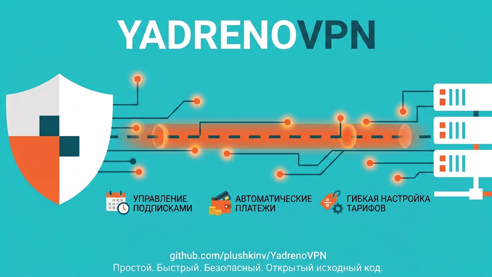

<p align="center">
  
</p>

<h1 align="center">Telegram-бот для автоматизации VPN-бизнеса на базе 3x-UI</h1>

<p align="center">
  <b>Принимает оплату, выдаёт подписки, управляет пользователями — пока вы спите.</b>
</p>

<p align="center">
  <a href="#1--регистрация-и-создание-vps-сервера">🚀 Создание сервера</a> •
  <a href="#2--установка-и-запуск">🛠️ Установка</a> •
  <a href="#3--продвижение-и-обновления">📈 Продвижение</a> •
  <a href="#4--использование-бота">🤖 Руководство</a> •
  <a href="#-вопросы-и-обсуждение">💬 Обсуждение</a>
</p>

---

## ✨ Возможности

| 🛡 Преимущества бота | 💳 Платежи и Финансы |
| :--- | :--- |
| ⚡ **Установка и настройка в 3 клика** (наше главное преимущество!)<br><br>🚀 **Все популярные протоколы:** VLESS (Reality, WS, gRPC), VMess, Trojan, Shadowsocks<br>🎁 **Пробные подписки:** настраиваемый бесплатный триал для новых клиентов<br>📂 **Группы серверов и тарифов:** гибкое разделение подписок (например, Базовый и Премиум)<br>🌍 **Подписки на несколько серверов:** через мастер-панель 3x-ui и ноды<br>🔗 **Реферальная система (до 3 уровней):** начисление вознаграждений бонусными днями или рублями на баланс<br>🔔 **Умные рассылки и автоуведомления:** напоминания об истечении срока подписки<br>👥 **Полный контроль:** статистика серверов, сброс лимитов и управление ключами прямо в админке Telegram<br><br>🔜 **В разработке:**<br>• 🎟 Промокоды и промоссылки<br>• 📱 Мини-апп и лендинги<br>• ⚙️ и многое другое... | 💰 **7 способов приёма оплат:**<br>• 💳 **Карты и СБП:** ЮKassa, Cardlink, WATA, Platega<br>• 🪙 **Криптовалюта:** CryptoBot (USDT, TON и др.)<br>• ⭐ **Telegram Stars**<br><br>🛒 **Единый внутренний баланс:** пополнение любым способом → покупка ключей<br>💎 **Умная доплата:** оплата части стоимости с баланса, а остатка — удобным платёжным методом<br>🔄 **Полная автоматизация:** моментальная автовыдача и продление подписок<br>📊 **Прозрачная статистика:** детальные отчёты по продажам и доходам<br>👥 Индивидуальные реферальные коэффициенты для партнёров и ручное управление балансом |

<br>
<h2 align="center">
  <a href="https://t.me/YadrenoAdmin_Bot">🚀 Заказать установку под ключ от 500₽</a>
</h2>
<p align="center">
  <b>Настройка VPN сервера + панель от VPN + бот для торговли и всё это уже будет связано!</b>
</p>
<p align="center">
  <sub><i>Услугу выполняет ИИ-агент (YadrenoAdmin) в автоматическом режиме, без личного участия автора. Гарантированный результат не предоставляется.</i></sub>
</p>
<br>

## 🎥 Видеоинструкции и обзоры

Для быстрого старта и понимания всех возможностей системы обязательно посмотрите эти видеоуроки от автора:

*   🎬 [**Свой VPN за 5 минут и 2$ + разворачиваю Telegram-бота**](https://www.youtube.com/watch?v=x987fH1t-nk) — Пошаговый гайд по созданию и запуску личного VPN-сервера с панелью 3x-ui и интеграцией Telegram-бота для автоматических продаж с нуля.
*   🤖 [**VPN-сервис под ключ: AI-агент всё сделает за 500₽**](https://www.youtube.com/watch?v=Bjb56K5FV0Q) — Подробный разбор того, как запустить VPN-бизнес полностью в автоматическом режиме с помощью нашего ИИ-агента, который сам свяжет 3x-ui и Telegram-бота.
*   ✨ [**Главный секрет YadrenoVPN: кастомизация и ИИ Агент**](https://www.youtube.com/watch?v=ACPu03aAJns) — Демонстрация возможностей гибкой кастомизации интерфейса бота, кнопок, текстов и цен по простым текстовым запросам к ИИ-агенту.
*   🌍 [**Несколько VPN-серверов в одной подписке: мастер-панель и ноды**](https://www.youtube.com/watch?v=BXV_KHdnrZc) — Техническое руководство по масштабированию вашей VPN-сети. Настройка единой мастер-панели 3x-ui и подключение удалённых серверов (нод) в разных странах.

---

## 1. 🚀 Регистрация и создание VPS-сервера

**Рекомендуемый хостинг:** [VDSina](https://www.vdsina.com/?partner=y7b4tz6w9mgf) — жирный канал 10 Гбит/сек установка VPN в 1 клик

### Шаг 2: Создание VPS-сервера

1. В личном кабинете нажмите **"Создать сервер"** и выберите **3X-UI VPN**
2. Выберите **локацию** — для VPN лучше выбрать **зарубежный дата-центр** (Амстердам, Франкфурт)
3. Выберите **тариф** — для начала достаточно минимального:
   - **1 vCPU**
   - **1 ГБ RAM** 
   - **10 ГБ SSD**
 
   > Этого хватит для ~20-50 одновременных пользователей VPN

4. Нажмите **"Создать"** и дождитесь запуска сервера (обычно 1-2 минуты)
5. После создания вы получите:
   - **IP-адрес** сервера
   - **Логин** (обычно `root`)
   - **Пароль** для SSH-подключения
   - ссылку вида `https://[IP_ADDRESS]/secret/` на панель управления 3X-UI VPN 


## 2. 🛠️ Установка и запуск

Подключитесь к серверу по SSH и выполните одну команду:
**Windows:** 
- Используйте [MobaXterm](https://mobaxterm.mobatek.net/)
```bash
bash <(curl -sL https://raw.githubusercontent.com/plushkinv/YadrenoVPN/main/install.sh)
```

Выберите **1) 🚀 Установка**, введите токен бота и ваш Telegram ID — скрипт сделает всё автоматически:
- обновит системные пакеты
- скачает репозиторий с GitHub
- создаст виртуальное окружение и установит зависимости Python
- настроит автозапуск через systemd
- запустит бота

Для обновления бота запустите скрипт повторно и выберите:
- **2) 🔄 Мягкое обновление** — `git pull` с сохранением локальных изменений
- **3) ⚠️ Жёсткая перезапись** — полная перезапись кода с GitHub (config.py и база данных не затрагиваются)

> 💡 Администрирование установленного бота описано в [руководстве администратора](ADMIN_GUIDE.md), а расширенная кастомизация через агента - в [руководстве YaAdmin](YAADMIN_GUIDE.md).

## 3. 📈 Продвижение и обновления

### Автоматический маркетинг
Добавьте в свой Telegram-канал бота [Ya.Footer](https://yadreno.ru/footer/). Он будет автоматически добавлять к каждому вашему посту кнопку или ссылку на вашего VPN-бота. Это значительно увеличит ваши продажи! 🚀

### Как следить за обновлениями
Подпишитесь на канал [Ядрёно.ру](https://t.me/YadrenoRu). Там выходят новости об обновлениях бота, новых функциях и исправлении багов. Рекомендуем регулярно проверять обновления и накатывать их через админ-панель бота.

---

## 4. 🤖 Использование бота

Подробная информация об админ-панели и возможностях встроенного агента находится в отдельных документах:

👉 **[Руководство администратора](ADMIN_GUIDE.md)**

👉 **[Руководство YaAdmin / Yadreno Admin](YAADMIN_GUIDE.md)**

---

## 💬 Вопросы и обсуждение

Пример работающего бота: https://t.me/Yadreno_VPNbot

И если у вас есть вопросы по боту, его разворачиванию пишите сюда - https://t.me/YadrenoAdmin_Bot он не только ответит на ваши вопросы но и может уставновить вам все под ключ!

Если вам нужна человеческая поддержка, или вы хотите высказать ваши пожелания по развитию бота, то вступайте в приватный чат - https://t.me/YadrenoAdmin_Bot

_Помимо всего в чате мы обсуждаем:_
- как рекламировать
- как настроить лучше протоколы
- как сделать обход белых списков
- и много много другого

---

## 👤 Автор и поддержка

**Разработчик:** [Plushkin Blog](https://t.me/plushkin_blog)

Я собираю деньги на разработку игры в жанре MMORTS с честной экономикой и никакого pay2win. Т.е. нельзя будет ничего купить у автора игры, никаких эксклюзивных вещей или бесконечных ресурсов для богатых.

Очень нужна ваша поддержка, даже 100р уже вперед. как говорится с мира по нитке ;)
💳 **Карты РФ:** https://yoomoney.ru/fundraise/1GJ73GGRJBC.260318
💰 **USDT (TON/BSC/ARBITRUM):** https://t.me/Ya_SellerBot?start=item-40
